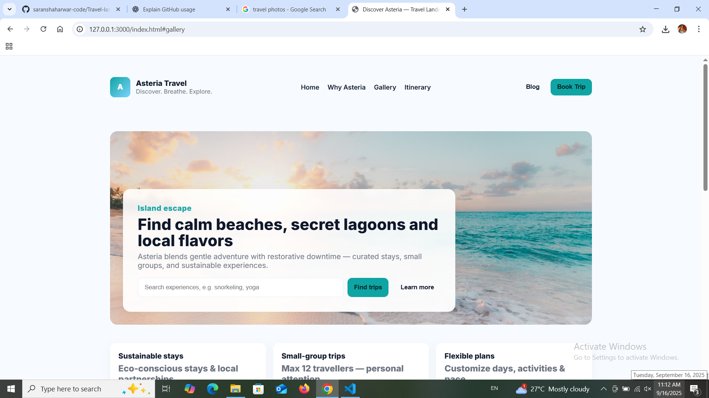

# README.md

## Travel Destination Landing Page (Responsive)
A clean, modern, and responsive landing page template for showcasing a travel destination (Asteria example). Built with HTML, CSS (vanilla, responsive grids and flexbox), and minimal JavaScript.

### Features
- Responsive layout with flexbox & grid
- Sticky navigation with mobile hamburger menu
- Hero section with CTA and search bar
- Gallery with lightbox functionality
- Sample itinerary section
- Testimonials slider (scrollable)
- Minimal, clean styling with Inter font

### Getting Started
1. Clone the repository:
   ```bash
   git clone https://github.com/saranshaharwar-code/travel-destination-landing.git
   cd travel-destination-landing
   ```
2. Open `index.html` in your browser.

### Customization
- Replace placeholder images in the **Gallery** with your own (Unsplash links used as examples).
- Update text content for your destination.
- Adjust colors, typography, or layout in the CSS.
- Hook CTAs to your booking form, CMS, or backend.

### Deployment
You can deploy this page easily on:
- GitHub Pages
- Netlify
- Vercel
- Any static hosting provider

---

#  Travel Landing Page — Asreria Travel

## 📖 Overview
A modern, responsive **restaurant landing page** built with **HTML, CSS, and JavaScript**.  
It showcases menu items, gallery, reservations, and contact details.  

👉 **Live Demo:** [Click Here](https://saranshaharwar-code.github.io/Travel-landing/)

---

## 🚀 Features
- Fully responsive (mobile, tablet, desktop)
- Hero section with restaurant branding
- About section with highlights
- Menu section with dishes and pricing
- Image gallery
- Online reservation form
- Contact details with map
- Footer with social links

---

## 🛠️ Tech Stack
- HTML5  
- CSS3 (Flexbox + Grid)  
- JavaScript (vanilla)  
- Deployed via **GitHub Pages**

---


## 📸 Screenshot



